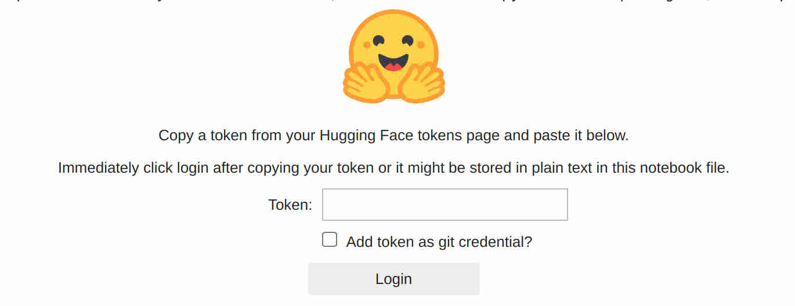

# NeuRIPS Workshop Guide

## Step One: Launch a Lambda Cloud instance


## Step Two: Download Notebooks

In dash board, click `Cloud IDE` - `Launch`, this will bring you to the Jupyter hub pre-installed on the cloud instance.

Create a new `Terminal` by clicking the `Terminal` button. In the terminal, run these two commands:

```
wget https://raw.githubusercontent.com/LambdaLabsML/dreambooth/neurips/setup.ipynb && \
wget https://raw.githubusercontent.com/LambdaLabsML/dreambooth/neurips/train.ipynb && \
wget https://raw.githubusercontent.com/LambdaLabsML/dreambooth/neurips/test.ipynb
```

Click the refresh button in the `File Browser` (on the left side of the IDE), you should see `setup.ipynb`, `train.ipynb` and `test.ipynb`. 

## Step Three: Run Notebook

### Run `setup.ipynb`

This notebook will clone the dreambooth repo, install a number of python packages needed for this pratice.

It will create a folder at `/home/ubuntu/data` for you to upload the training photos.

The last step in thie notebook will ask for a access token for downloading the Stable Diffusion model from Huggingface. You need to  

* Create a [huggingface](https://huggingface.co/) account if you don't have one.
* Create your access token from "Settings - Access Tokens - New Token", and paste the token into the login field at the end of the notebook (see image below). 

* Accept the [license of Stable Diffusion v1-4 Model Card](https://huggingface.co/CompVis/stable-diffusion-v1-4) if you agree. (Otherwise can't use the model)


### Run `train.ipynb`
This notebook will train a dreambooth model using the images you just uploaded.

Once trained, it will run some validations using the prompts in the `test_dreambooth.py` script.

### Run `test.ipynb`
You can use this notebook to play with the model you just trained. There are also some examples of prompt engineering tricks in it!

## Q&A
