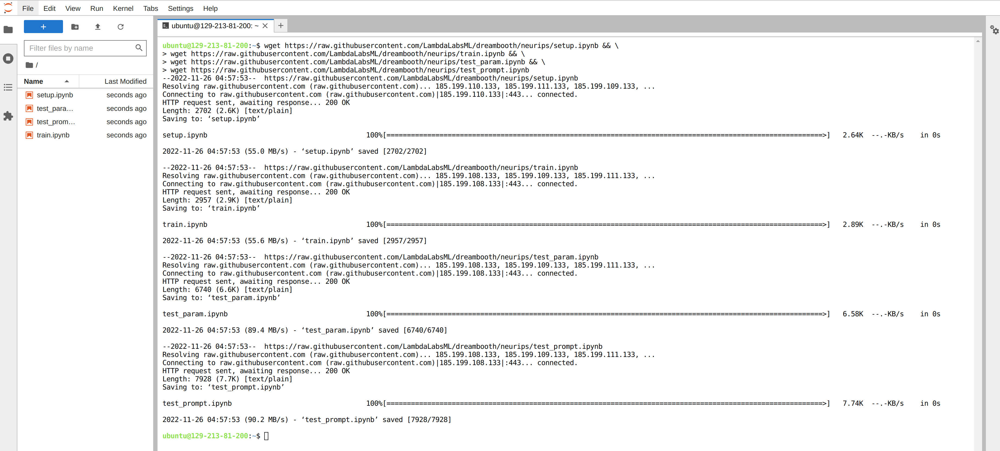

# NeuRIPS Workshop Guide

## Step One: Launch a Lambda Cloud instance

The hands-on practice requires a Lambda Cloud account and a `1xA100` GPU instance, which costs `$1.10 USD/h`. 

Remember to drop by our photo booth if you do not wish to sign up. Our staff will take photos and train a model for you. Leave us your email address, and we will send the results within 12 hours.

If you wish to sign up, go to [https://cloud.lambdalabs.com/](https://cloud.lambdalabs.com/) and follow the signup step.

Once signed in with your Lambda Cloud account, click the `Launch Instance` button.


Lambda Cloud will ask you for payment information when launching the first instance. Just follow the instructions and be aware that Lambda Cloud will place a __temporary__ `$10 USD pre-auth to verify your card, which will disappear within seven days. Once payment information is provided, you can launch an instance. For this workshop:
* Choose 1xA100 instance (40GB SXM4 or 40GB PCIe are both fine).
* Any region will work.
* Don't need to attach a filesystem.
* Follow the guide to add or generate an SSH key -- this step can not be skipped. However, this workshop won't use this key because all practice can be accomplished in the Cloud IDE (so no SSH session is needed).

It takes about two mins to get the instance running (the green tick as shown in the picture below). 


You need to click the Cloud IDE `Launch` button (the purple button on the right end) to get access to the Jupyter Hub. If you see a message saying, "Your Jupyter Notebook is down," that means the Jupyter Hub isn't ready and please give it another minute or so. Eventually, it will look like this once it is ready:


## Step Two: Download Notebooks

Create a terminal by clicking the `Terminal` icon, and run the following command in the terminal to download a few notebooks to your home directory.

```
wget https://raw.githubusercontent.com/LambdaLabsML/dreambooth/neurips/setup.ipynb && \
wget https://raw.githubusercontent.com/LambdaLabsML/dreambooth/neurips/train.ipynb && \
wget https://raw.githubusercontent.com/LambdaLabsML/dreambooth/neurips/test_param.ipynb && \
wget https://raw.githubusercontent.com/LambdaLabsML/dreambooth/neurips/test_prompt.ipynb
```

You need to click the refresh button in the `File Browser` (on the left side of the IDE) to see the notebooks. 



Now you are ready to kick off the DreamBooth practice!

## Step Three: Run Notebook

### Run `setup.ipynb`

This notebook will clone the DreamBooth repo and install several python packages. It will also create several folders in the home directory:
* `/home/ubuntu/data`: This directory stores training photos.
* `/home/ubuntu/model`: This is the directory where the trained model will be saved.
* `/home/ubuntu/output`: This is the directory where the sampled images will be saved.

The last step in this notebook will ask for an access token for downloading the Stable Diffusion model from Huggingface. You need to:  
* Create a [huggingface](https://huggingface.co/) account if you don't have one.
* Create your access token from "Settings - Access Tokens - New Token," and paste the token into the login field at the end of the notebook (see image below).

* Accept the [license of Stable Diffusion v1-4 Model Card](https://huggingface.co/CompVis/stable-diffusion-v1-4) if you agree. (Otherwise can't use the model)


### Upload Images

We recommend preparing ~20 photos: ten close-ups of your face with various poses and facial expressions, five photos from your chest and up, and a few full-body shots.

### Run `train.ipynb`
This notebook trains a DreamBooth model use the images inside of `/home/ubuntu/data`.

Once trained, it will also run a few inferences and display the prompts and sampled images at the end of the notebook.

### Run `test_prompt.ipynb` and `test.ipynb`
You can use these notebooks to play with the model you just trained. 

* `test_prompt.ipynb`: A notebook for prompt engineering. You will use fixed latent input to conduct controlled experiments for the impact of prompt engineering on the model output.

* `test_param.ipynb`: A notebook for trying different parameters for inference. Again, you will use fixed latent input to conduct controlled experiments for the impact of these parameters on the model output. 
