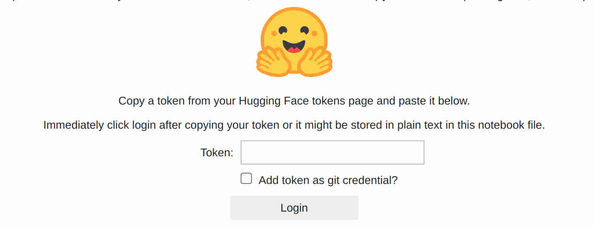
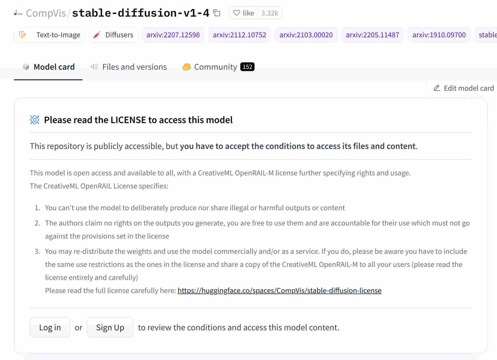
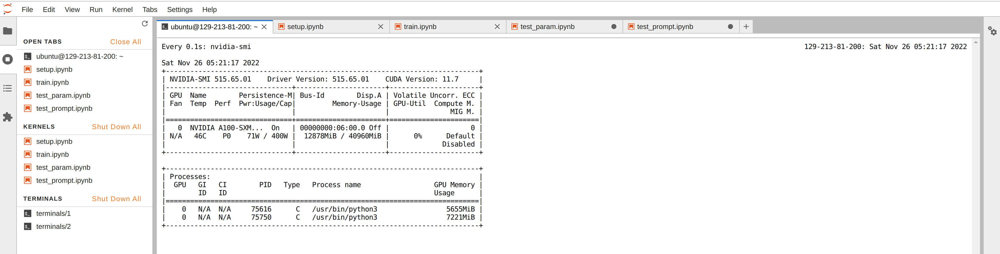

# Cloud Offsite Workshop Guide

1. [Step One: Launch a Lambda Cloud Instance](#step-one-launch-a-lambda-cloud-instance)
2. [Step Two: Download Notebooks](#step-two-download-notebooks)
3. [Step Three: Run Notebooks](#step-three-run-notebooks)
5. [Q&A](#qa)

## Step One: Launch a Lambda Cloud Instance

A single A10 instance should be enough. Dreambooth training will run faster on a beefier GPU, though multiple GPUs are not particularly beneficial to this particular tutorial.


## Step Two: Download Notebooks

Create a terminal by clicking the `Terminal` icon, and run the following command in the terminal to download a few notebooks to your home directory.

```
wget https://raw.githubusercontent.com/LambdaLabsML/dreambooth/offsite/offsite2023/setup.ipynb && \
wget https://raw.githubusercontent.com/LambdaLabsML/dreambooth/offsite/offsite2023/train.ipynb && \
wget https://raw.githubusercontent.com/LambdaLabsML/dreambooth/offsite/offsite2023/train_wandb.ipynb && \
wget https://raw.githubusercontent.com/LambdaLabsML/dreambooth/offsite/offsite2023/test_func_call.ipynb
```

You need to click the refresh button in the `File Browser` (on the left side of the IDE) to see the notebooks. 

Now you are ready to kick off the DreamBooth practice!

## Step Three: Run Notebooks

### Run `setup.ipynb`

This notebook will clone the DreamBooth repo and install several python packages. 

It will also create a `/home/ubuntu/data`` folder in the home directory for you to upload training images.

The last step in this notebook will ask for an access token for downloading the Stable Diffusion model from Huggingface. You need to:  
* Create a [huggingface](https://huggingface.co/) account if you don't have one.
* Create your access token from "Settings - Access Tokens - New Token," and paste the token into the login field at the end of the notebook.
* Accept the [license of Stable Diffusion v1-4 Model Card](https://huggingface.co/CompVis/stable-diffusion-v-1-4-original) if you agree. (Otherwise can't use the model)



### Upload Images

We recommend preparing ~20 photos: ten close-ups of your face with various poses and facial expressions, five photos from your chest and up, and a few full-body shots.

### Run `train.ipynb`
This notebook trains a DreamBooth model use the images inside of `/home/ubuntu/data`.

Once trained, it will also run a few inferences and display the prompts and sampled images at the end of the notebook.


Also don't forget to checkout [our case studies](https://wandb.ai/justinpinkney/dreambooth/reports/Training-comparisons--VmlldzozMDM0MzY2) for different training settings.

## Q&A

### How to free GPU memory of unused notebooks?

When a notebook is completed and closed, its kernel may still be alive. To free the GPU memory, you need to go to the `Running Terminals and Kernels` on the left side of the screen and manually shut down the unwanted kernels:




### Where can I find inspirations for prompts?

Try [publicprompts.art](https://publicprompts.art/) and [Gustavosta's Prompt dataset](https://huggingface.co/datasets/Gustavosta/Stable-Diffusion-Prompts).